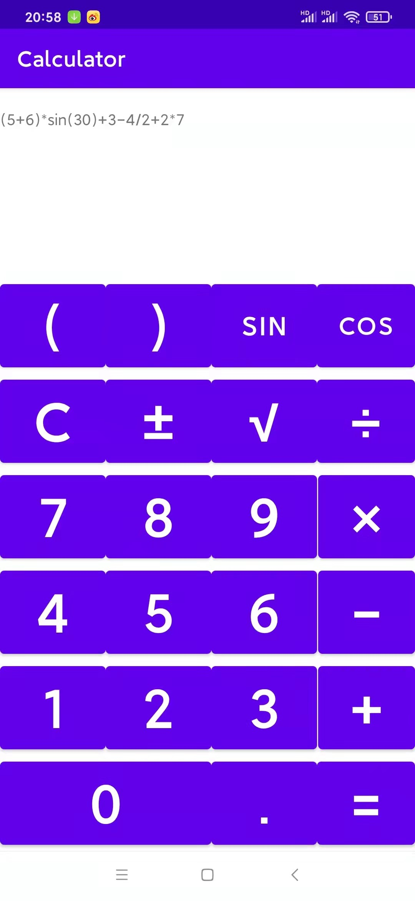
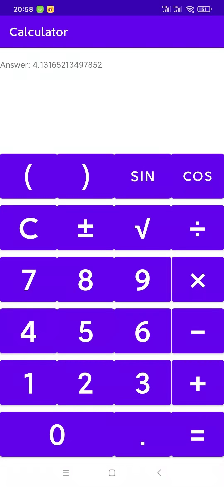
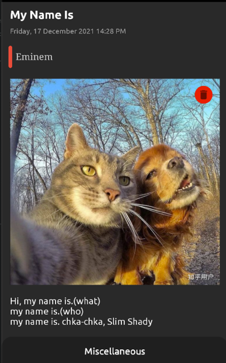

# Android

Check project files in its branch. There's only basic information in the main branch.

- [x] Calculator(100%)
 

  
  

- [x] Journal(100%)

> 

- [x] Weather(100%)

> 

- [x] Media Player(100%)

> 

All git branch merged into one.

Thanks to online Android tutorials.
